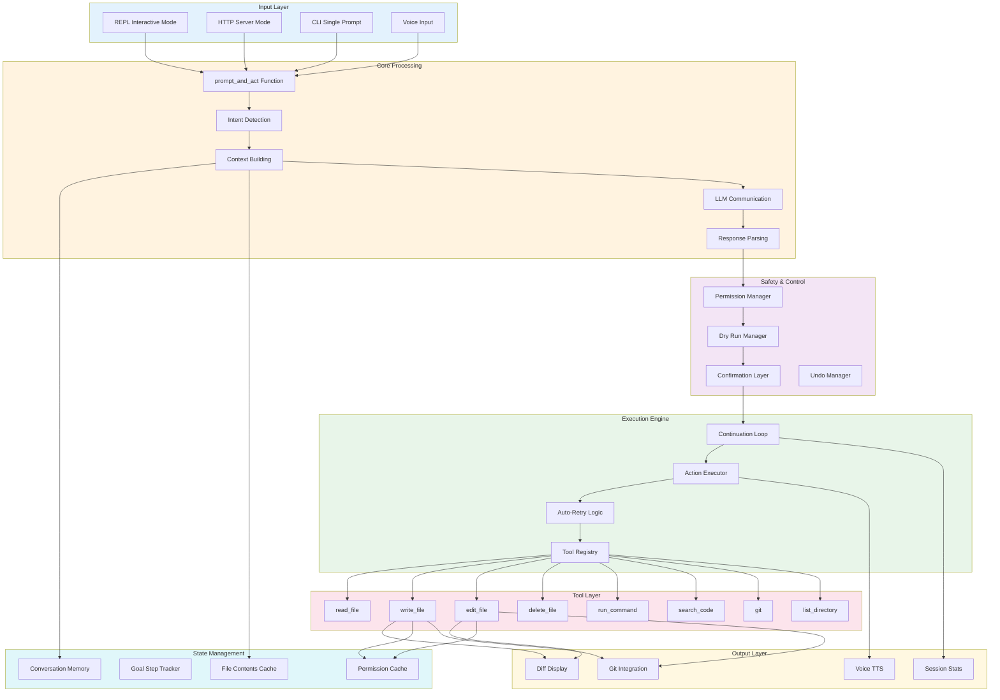
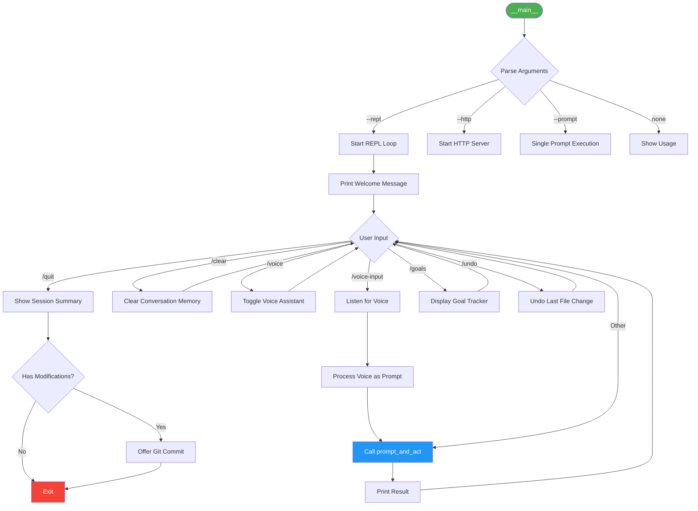
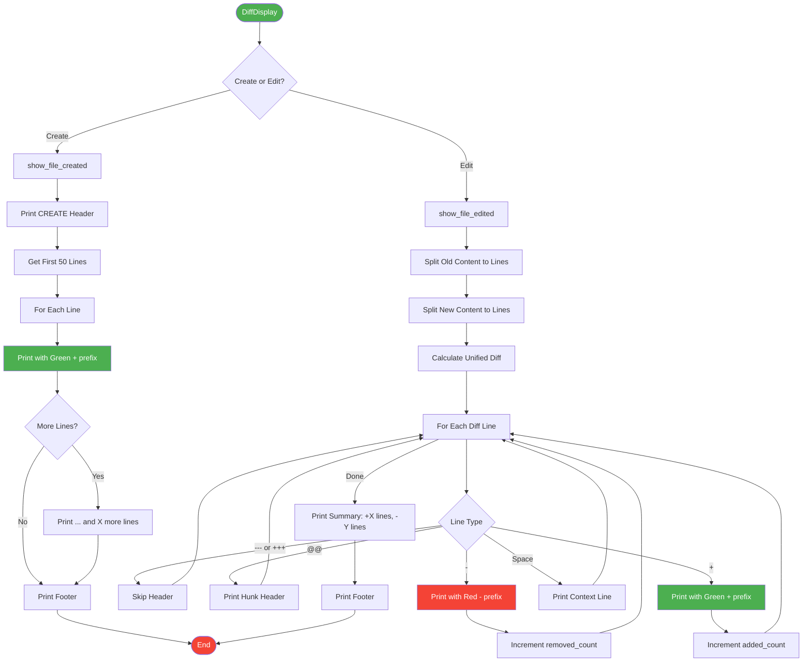
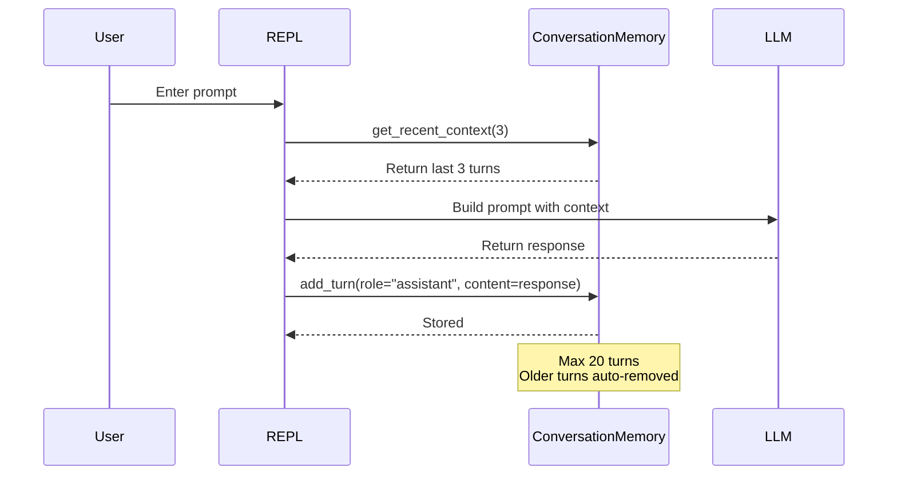
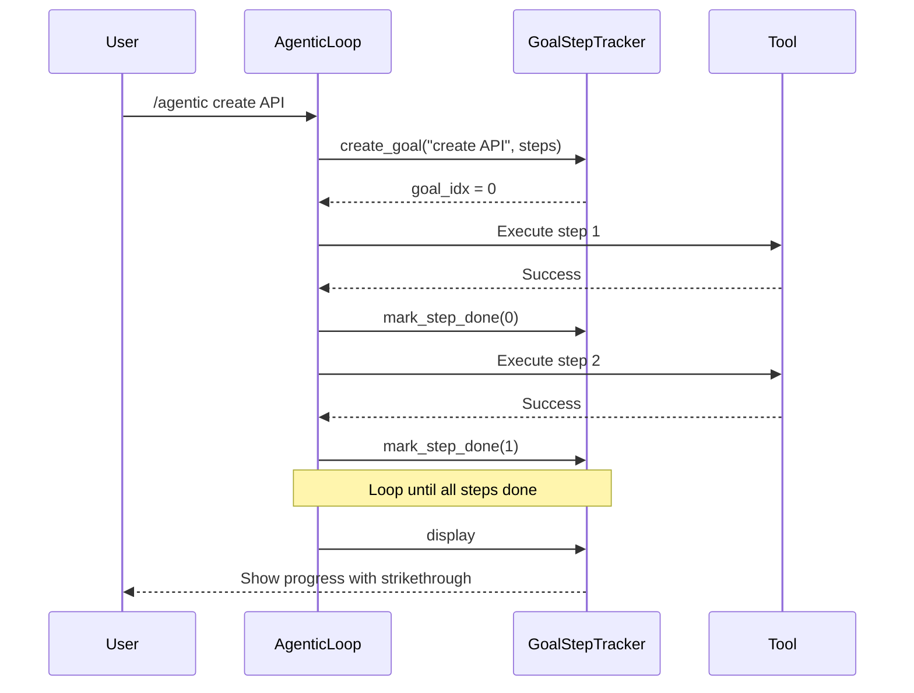
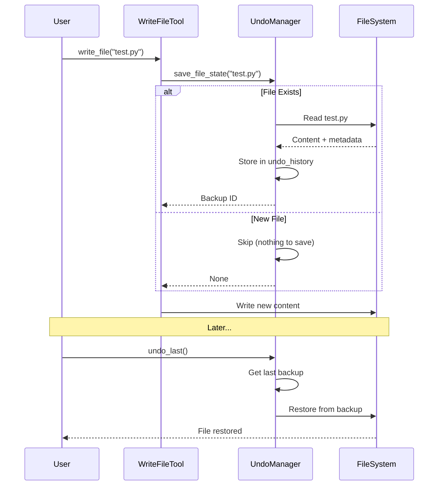
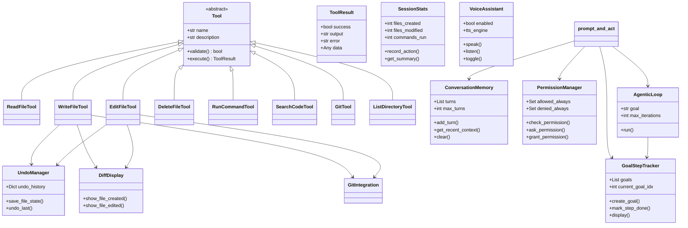

# Agentic Bridge - Developer Architecture Guide

This document provides detailed flowcharts and architecture diagrams for developers who want to understand or modify the codebase.

---

## System Overview



---

## Main Entry Point Flow



---

## prompt_and_act Function Flow

```mermaid
flowchart TD
    FuncStart([prompt_and_act]) --> Init[Initialize Globals]
    
    Init --> CheckDryRun{Starts with /dry-run?}
    CheckDryRun -->| Yes | EnableDryRun[Enable Dry Run Mode]
    EnableDryRun --> Return1[Return Early]
    
    CheckDryRun -->| No --> CheckUndo{Is /undo?}
    CheckUndo -->| Yes | UndoCall[Call undo_manager.undo_last]
    UndoCall --> Return2[Return Result]
    
    CheckUndo -->| No --> CheckGoals{Is /goals?}
    CheckGoals -->| Yes | DisplayGoals[goal_tracker.display]
    DisplayGoals --> Return3[Return Result]
    
    CheckGoals -->| No --> CheckVoice{Is /voice or /voice-input?}
    CheckVoice -->| Yes | HandleVoice[Handle Voice Commands]
    HandleVoice --> Return4[Return Result]
    
    CheckVoice -->| No --> CheckAgentic{Starts with /agentic?}
    CheckAgentic -->| Yes | RunAgentic[run_agentic_mode]
    RunAgentic --> Return5[Return Result]
    
    CheckAgentic -->| No --> BuildContext[Build Context]
    
    BuildContext --> GetRecent[Get Recent Conversation]
    GetRecent --> AutoRead[Auto-read File Before Edit]
    AutoRead --> MultiFile[Multi-file Context if Needed]
    
    MultiFile --> CombineContext[Combine All Context Parts]
    CombineContext --> DetectIntent[detect_intent_and_prepare_prompt]
    
    DetectIntent --> IntentCheck{Explanation Request?}
    IntentCheck -->| Yes | LLMPrompt[Build LLM Prompt]
    IntentCheck -->| No | FullPrompt[Use Combined Context]
    
    LLMPrompt --> CallLLM1[Call LLM - No Actions]
    CallLLM1 --> StoreMem1[Add to Memory]
    StoreMem1 --> Return6[Return Response]
    
    FullPrompt --> CallLLM2[Call LLM - May Have Actions]
    CallLLM2 --> ParseActions[parse_all_actions_from_response]
    
    ParseActions --> HasPlan{Has Plan?}
    HasPlan -->| Yes | ExecPlan[execute_plan]
    ExecPlan --> StoreMem2[Add to Memory]
    StoreMem2 --> Return7[Return Result]
    
    HasPlan -->| No --> HasActions{Has Actions?}
    HasActions -->| No | StoreMem3[Add to Memory]
    StoreMem3 --> Return8[Return Response]
    
    HasActions -->| Yes --> ContinuationLoop[Enter Continuation Loop]
    ContinuationLoop --> LoopResult[Return Loop Results]
    LoopResult --> AutoComplete{Read Then Edit?}
    AutoComplete -->| Yes | AutoEdit[Auto-Complete Edit]
    AutoComplete -->| No | StoreMem4[Add to Memory]
    AutoEdit --> StoreMem4
    StoreMem4 --> Return9[Return Result]
    
    style FuncStart fill:#4caf50,color:#fff
    style ContinuationLoop fill:#ff9800,color:#fff
    style CallLLM1 fill:#2196f3,color:#fff
    style CallLLM2 fill:#2196f3,color:#fff
```

---

## Continuation Loop (Detailed)

```mermaid
flowchart TD
    LoopStart([Continuation Loop]) --> InitVars[Initialize Variables]
    
    InitVars --> InitVars2["executed_actions_summary = []
executed_action_hashes = set()
file_contents_read = {}
iteration = 0
total_successful = 0"]
    
    InitVars2 --> PrintStart[Print Task Execution Started]
    
    PrintStart --> LoopCheck{iteration < max_iterations?}
    LoopCheck -->| No | LoopExit[Exit Loop]
    
    LoopCheck -->| Yes --> IncIter[iteration += 1]
    
    IncIter --> FirstIter{iteration == 1?}
    FirstIter -->| Yes | UseInitial[Use Initial Actions]
    
    FirstIter -->| No | BuildContinuation[Build Continuation Prompt]
    
    BuildContinuation --> AddContext["Add:
- Actions completed
- File contents read
- Critical rules
- No repeat instructions"]
    
    AddContext --> CallLLMCont[Call LLM for Continuation]
    CallLLMCont --> CheckTruncated{Response Truncated?}
    CheckTruncated -->| Yes | RequestCont[Request Continuation]
    RequestCont --> AppendCont[Append to Response]
    AppendCont --> ParseCont
    CheckTruncated -->| No | ParseCont[Parse Actions from Response]
    
    ParseCont --> CheckComplete{Has [TASK_COMPLETE]?}
    CheckComplete -->| Yes | PrintComplete[Print Task Complete]
    PrintComplete --> LoopExit
    
    CheckComplete -->| No --> HasActionsCont{Has Actions?}
    HasActionsCont -->| No | PrintNoMore[Print No More Actions]
    PrintNoMore --> LoopExit
    
    HasActionsCont -->| Yes --> ExecBatch[Execute Action Batch]
    
    UseInitial --> ExecBatch
    
    ExecBatch --> ForEachAction{For Each Action}
    ForEachAction -->| Done | CheckBatch{batch_successful > 0?}
    
    CheckBatch -->| No | PrintNoSucceed[Print No Actions Succeeded]
    PrintNoSucceed --> LoopExit
    
    CheckBatch -->| Yes --> LoopCheck
    
    ForEachAction -->| Next | CheckDup{Action in Hash Set?}
    CheckDup -->| Yes | SkipDup[Skip Duplicate]
    SkipDup --> ForEachAction
    
    CheckDup -->| No | AddHash[Add to Hash Set]
    AddHash --> CheckPermCont{File Operation?}
    
    CheckPermCont -->| Yes | CheckPermAllowed{In allowed_always?}
    CheckPermAllowed -->| Yes | ExecAction
    CheckPermAllowed -->| No | AskPermCont[Ask Permission A/D/AA]
    AskPermCont --> PermDeniedCont{Denied?}
    PermDeniedCont -->| Yes | SkipPerm[Skip Action]
    SkipPerm --> ForEachAction
    PermDeniedCont -->| No | ExecAction
    
    CheckPermCont -->| No | ExecAction[Execute Action]
    
    ExecAction --> ActionSuccess{Success?}
    ActionSuccess -->| Yes | TrackSuccess[Increment Counters]
    TrackSuccess --> TrackContext["Add to:
    - executed_actions_summary
    - file_contents_read if read_file"]
    TrackContext --> ForEachAction
    
    ActionSuccess -->| No | PrintFail[Print Failure]
    PrintFail --> ForEachAction
    
    LoopExit --> BuildResult[Build Result Dictionary]
    BuildResult --> CheckAutoComplete{Action was read_file + Edit Intent?}
    
    CheckAutoComplete -->| Yes | AutoCompleteEdit[Auto-Complete Edit Flow]
    CheckAutoComplete -->| No | ReturnFinal[Return Final Result]
    
    AutoCompleteEdit --> BuildEditPrompt[Build Edit Prompt with File Content]
    BuildEditPrompt --> CallLLMEdit[Call LLM for Edit]
    CallLLMEdit --> ParseEdit[Parse Edit Action]
    ParseEdit --> ExecEdit[Execute Edit]
    ExecEdit --> ReturnFinal
    
    style LoopStart fill:#4caf50,color:#fff
    style LoopExit fill:#f44336,color:#fff
    style ContinuationLoop fill:#ff9800,color:#fff
    style ExecAction fill:#2196f3,color:#fff
    style ReturnFinal fill:#9c27b0,color:#fff
```

---

## Permission Manager Flow

```mermaid
flowchart TD
    PermStart([check_permission]) --> CheckType{action.type == tool?}
    
    CheckType -->| No | ReturnTrue1[Return True, ]
    
    CheckType -->| Yes --> GetTool[Get tool name]
    GetTool --> IsFileOp{write_file/edit_file/delete_file?}
    
    IsFileOp -->| No | ReturnTrue2[Return True, ]
    
    IsFileOp -->| Yes --> GetPath[Get filepath]
    GetPath --> CheckAllowed{In allowed_always?}
    
    CheckAllowed -->| Match | ReturnAllowed[Return True, Allowed by pattern]
    
    CheckAllowed -->| No Match --> CheckDenied{In denied_always?}
    CheckDenied -->| Match | ReturnDenied[Return False, Denied by pattern]
    
    CheckDenied -->| No Match --> ReturnAsk[Return False, Requires Permission]
    
    subgraph AskPermission["ask_permission Flow"]
        AskStart[Print Permission Request Header]
        AskStart --> PrintTool[Print Tool Name]
        PrintTool --> PrintFile[Print Filepath]
        PrintFile --> PrintOptions["Print Options:
        [A] Allow
        [D] Deny
        [AA] Allow Always"]
        PrintOptions --> GetChoice[Get User Input]
        GetChoice --> CheckChoice{Choice}
        
        CheckChoice -->| A/ALLOW | ReturnAllow[Return True]
        CheckChoice -->| D/DENY | ReturnDeny[Return False]
        CheckChoice -->| AA/ALLOW ALWAYS | GrantAlways[grant_permission with always]
        GrantAlways --> ReturnAllow
        
        CheckChoice -->| Invalid | PrintInvalid[Print Invalid]
        PrintInvalid --> ReturnDeny
        
        CheckChoice -->| Interrupted | PrintInterrupted[Print Interrupted]
        PrintInterrupted --> ReturnDeny2[Return False]
    end
    
    ReturnAsk --> AskPermission
    
    style PermStart fill:#4caf50,color:#fff
    style ReturnTrue1 fill:#8bc34a,color:#fff
    style ReturnTrue2 fill:#8bc34a,color:#fff
    style ReturnAllowed fill:#8bc34a,color:#fff
    style ReturnDenied fill:#f44336,color:#fff
    style ReturnAsk fill:#ff9800,color:#fff
    style ReturnAllow fill:#8bc34a,color:#fff
    style ReturnDeny fill:#f44336,color:#fff
    style ReturnDeny2 fill:#f44336,color:#fff
```

---

## Diff Display Flow



---

## Tool Execution Flow

```mermaid
flowchart TD
    ToolStart([execute_action]) --> GetType{action.type}
    
    GetType -->| command | ExecCommand[Execute run_command]
    ExecCommand --> CommandResult[Return ToolResult]
    
    GetType -->| tool | GetToolName[Get tool_name & params]
    GetToolName --> ToolExists{In TOOL_REGISTRY?}
    ToolExists -->| No | ErrUnknown[Return Unknown Tool Error]
    
    ToolExists -->| Yes --> GetTool[Get Tool Instance]
    GetTool --> Validate[Call tool.validate]
    Validate --> Valid{Is Valid?}
    
    Valid -->| No | CheckRetry{auto_retry && retries < max?}
    CheckRetry -->| Yes | AutoCorrect[auto_correct_parameters]
    AutoCorrect --> Corrected{Success?}
    Corrected -->| Yes | UpdateParams[Update params, retries++]
    UpdateParams --> Validate
    
    Corrected -->| No | ReturnValidErr[Return Validation Error]
    CheckRetry -->| No | ReturnValidErr
    
    Valid -->| Yes --> ExecTool[Call tool.execute]
    ExecTool --> ToolSuccess{Success?}
    
    ToolSuccess -->| No | CheckRetry2{auto_retry && retries < max?}
    CheckRetry2 -->| Yes | AutoCorrect2[auto_correct_parameters]
    AutoCorrect2 --> Corrected2{Success?}
    Corrected2 -->| Yes | UpdateParams2[Update params, retries++]
    UpdateParams2 --> ExecTool
    
    Corrected2 -->| No | ReturnToolErr[Return Tool Error]
    CheckRetry2 -->| No | ReturnToolErr
    
    ToolSuccess -->| Yes | ReturnSuccess[Return Success Result]
    
    CommandResult --> ToolEnd([End])
    ErrUnknown --> ToolEnd
    ReturnValidErr --> ToolEnd
    ReturnToolErr --> ToolEnd
    ReturnSuccess --> ToolEnd
    
    style ToolStart fill:#4caf50,color:#fff
    style ToolEnd fill:#f44336,color:#fff
    style ExecTool fill:#2196f3,color:#fff
    style ReturnSuccess fill:#8bc34a,color:#fff
```

---

## Auto-Correction Flow (Filename Typo Fix)

```mermaid
flowchart TD
    AutoStart([find_similar_file]) --> FileExists{File Exists?}
    FileExists -->| Yes | ReturnSame[Return Original Path]
    
    FileExists -->| No --> GetDir[Get Directory]
    GetDir --> GetBase[Get Basename]
    GetBase --> DirExists{Directory Exists?}
    
    DirExists -->| No | ReturnOrig[Return Original Path]
    
    DirExists -->| Yes --> ListFiles[List Directory Contents]
    ListFiles --> ForEachFile[For Each File in Directory]
    
    ForEachFile --> CalcDistance[Calculate Levenshtein Distance]
    CalcDistance --> WithinMax{distance <= max_distance?}
    
    WithinMax -->| Yes | ReturnFound[Return Found Path]
    WithinMax -->| No | NextFile{More Files?}
    
    NextFile -->| Yes | ForEachFile
    NextFile -->| No | ReturnOrig2[Return Original Path]
    
    ReturnSame --> AutoEnd([End])
    ReturnOrig --> AutoEnd
    ReturnFound --> AutoEnd
    ReturnOrig2 --> AutoEnd
    
    subgraph Levenshtein["Levenshtein Distance Calculation"]
        LevStart[Function levenshtein_distance s1, s2]
        LevStart --> Swap{len s1 < len s2?}
        Swap -->| Yes | SwapVars[Swap s1 and s2]
        Swap -->| No | CheckEmpty{len s2 == 0?}
        CheckEmpty -->| Yes | ReturnLen[Return len s1]
        CheckEmpty -->| No | InitRow[Initialize previous_row]
        
        InitRow --> ForEachC1[For Each Character c1 in s1]
        ForEachC1 --> InitCurrent[Initialize current_row]
        InitCurrent --> ForEachC2[For Each Character c2 in s2]
        
        ForEachC2 --> CalcMin["Calculate min of:
        - insertions
        - deletions
        - substitutions"]
        CalcMin --> AppendRow[Append to current_row]
        AppendRow --> ForEachC2
        
        ForEachC2 -->| Done | UpdateRow[previous_row = current_row]
        UpdateRow --> ForEachC1
        
        ForEachC1 -->| Done | ReturnLast[Return previous_row[-1]]
        
        ReturnLen --> LevEnd
        ReturnLast --> LevEnd
    end
    
    AutoEnd --> LevStart
    
    style AutoStart fill:#4caf50,color:#fff
    style AutoEnd fill:#f44336,color:#fff
    style ReturnFound fill:#8bc34a,color:#fff
    style CalcDistance fill:#2196f3,color:#fff
```

---

## Voice Assistant Flow

```mermaid
flowchart TD
    VoiceStart([VoiceAssistant]) --> Init[Initialize]
    
    Init --> InitTTS[_init_tts]
    InitTTS --> TryPyttsx3{Import pyttsx3?}
    
    TryPyttsx3 -->| Success | CreateEngine[pyttsx3.init]
    CreateEngine --> SetProps["Set Properties:
    - rate: 150
    - volume: 0.9"]
    SetProps --> StoreEngine[Store in self.tts_engine]
    
    TryPyttsx3 -->| Failed | PrintErr1[Print Error Message]
    PrintErr1 --> StoreEngine2[Set tts_engine = None]
    
    StoreEngine --> SpeakFlow
    StoreEngine2 --> SpeakFlow
    
    subgraph Speak["speak Flow"]
        SpeakStart{enabled && tts_engine?}
        SpeakStart -->| No | SpeakEnd
        SpeakStart -->| Yes | CleanText[Clean Text for Speech]
        CleanText --> RemoveTags[Remove [TOOL] tags]
        RemoveTags --> RemoveCode[Remove code blocks]
        RemoveCode --> RemoveMarkdown[Remove markdown chars]
        RemoveMarkdown --> TTSsay[tts_engine.say]
        TTSsay --> TTSWait[tts_engine.runAndWait]
        TTSWait --> SpeakEnd([End Speak])
    end
    
    subgraph Listen["listen Flow"]
        ListenStart{Import speech_recognition?}
        ListenStart -->| No | PrintErr2[Print Error]
        PrintErr2 --> ListenEnd([Return ])
        
        ListenStart -->| Yes | InitRec[Create Recognizer]
        InitRec --> OpenMic[Open Microphone]
        OpenMic --> AdjNoise[Adjust for Ambient Noise]
        AdjNoise --> ListenMic[Listen with timeout]
        ListenMic --> Recognize[recognize_google]
        
        Recognize --> RecognizeSuccess{Success?}
        RecognizeSuccess -->| Yes | PrintHeard[Print You said: text]
        PrintHeard --> ReturnText[Return text]
        
        RecognizeSuccess -->| NotUnderstood | PrintNot[Print Could Not Understand]
        PrintNot --> ReturnEmpty1[Return ]
        
        RecognizeSuccess -->| ServiceError | PrintService[Print Service Error]
        PrintService --> ReturnEmpty2[Return ]
    end
    
    SpeakFlow --> Speak
    ListenFlow --> Listen
    
    style VoiceStart fill:#4caf50,color:#fff
    style SpeakEnd fill:#f44336,color:#fff
    style ListenEnd fill:#f44336,color:#fff
    style ReturnText fill:#8bc34a,color:#fff
    style ReturnEmpty1 fill:#ff9800,color:#fff
    style ReturnEmpty2 fill:#ff9800,color:#fff
```

---

## Data Flow Diagrams

### Conversation Memory Flow



### Goal Tracker Flow



### Undo Manager Flow



---

## Class Relationships



---

## Configuration Points

### Environment Variables

| Variable | Description | Default |
|----------|-------------|---------|
| `AGENTIC_STREAM` | Enable streaming output | `0` |
| `VSCODE_CURRENT_FILE` | Current file in VS Code | - |
| `OLLAMA_MODEL` | Model to use | `qwen3.5` |

### Constants to Modify

```python
# Model configuration
OLLAMA_MODEL = "qwen3.5"
OLLAMA_API_URL = "http://localhost:11434/api/generate"
CHAT_API_URL = "http://localhost:11434/api/chat"

# Safety configuration
DESTRUCTIVE_COMMANDS = ["rm ", "del ", ...]
ALLOWED_FILE_EXTENSIONS = [".py", ".js", ...]

# Loop configuration
max_iterations = 10  # Continuation loop max
max_retries = 2      # Auto-retry attempts
```

---

## Extension Points

### Adding a New Tool

1. Create new class inheriting from `Tool`
2. Implement `validate()` and `execute()` methods
3. Register in `TOOL_REGISTRY`

```python
class MyNewTool(Tool):
    name = "my_new_tool"
    description = "Does something new"
    
    def validate(self, **kwargs) -> Tuple[bool, str]:
        # Validation logic
        return True, ""
    
    def execute(self, **kwargs) -> ToolResult:
        # Execution logic
        return ToolResult(success=True, output="Done")

# Register
TOOL_REGISTRY["my_new_tool"] = MyNewTool()
```

### Adding a New Command

Add to `prompt_and_act()` function:

```python
if prompt == "/mycommand":
    # Handle command
    return {"response": "Result", "action": None, ...}
```

Add to REPL help in `__main__`:

```python
print("  /mycommand  - Description here")
```

---

<div align="center">

**For questions or contributions, see main README.md**

</div>
