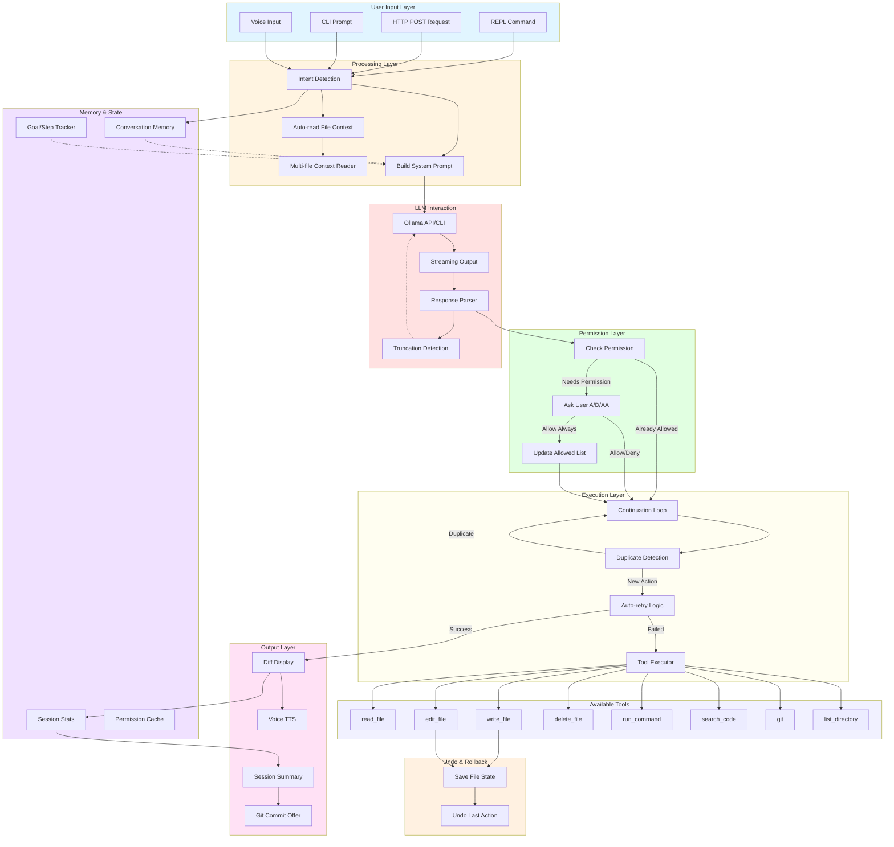

# Agentic Bridge - Local AI Agent

A complete agentic AI system that enables local LLM models (via Ollama) to perform real actions on your system - similar to Claude or GitHub Copilot, but running 100% locally.


## Table of Contents

- [Features](#features)
- [Prerequisites](#prerequisites)
- [Installation](#installation)
- [Usage](#usage)
- [Interactive REPL Commands](#interactive-repl-commands)
- [Modes of Operation](#modes-of-operation)
- [New Features (Latest)](#new-features-latest)
- [Code Structure](#code-structure)
- [Architecture Diagram](#architecture-diagram)
- [Mermaid Flow Diagram](#mermaid-flow-diagram)
- [Example Interactions](#example-interactions)
- [Troubleshooting](#troubleshooting)
- [Extending the Agent](#extending-the-agent)

---

## Features

### Core Features
- **Tool-Based Architecture**: 8 built-in tools for file operations, commands, git, and search
- **Multi-Step Planning**: Break complex tasks into sequential actions
- **Conversation Memory**: Maintains context across multiple turns
- **Safety Layer**: Confirmation prompts for destructive actions
- **Multiple Interfaces**: REPL, HTTP server, and CLI modes
- **Smart Filename Correction**: Auto-corrects typos in filenames using Levenshtein distance

### Advanced Features
1. **Auto-Retry with Corrected Parameters**: When a tool fails (e.g., file not found), automatically retries with corrections
2. **Undo/Rollback Capability**: Track file changes and revert the last action with `/undo`
3. **Dry-Run Mode**: Preview actions before executing with `/dry-run`
4. **Better Error Messages**: Shows suggestions and lists files in directory when errors occur
5. **Multi-File Context Understanding**: Automatically reads related files when explaining code
6. **Code Execution Sandbox**: Safely run Python/JS code with `/run-python` or `/run-js`
7. **Progress Indicators**: Shows `[Step X/Y]` progress for long operations
8. **Session Summaries**: Displays accomplishments on exit
9. **Output Mode Toggle**: Switch between verbose and minimal output
10. **Git Integration**: Auto-detects repo and offers to commit changes
11. **Multi-Action Execution**: Executes ALL tool calls in a single response (creates multiple files at once)
12. **Real-Time Streaming**: Watch the LLM's reasoning as it generates responses
13. **Continuation Loop**: Automatically continues executing until task is complete (like Claude)
14. **Claude-like Permission Prompts**: 3 options (Allow/Deny/Allow Always) for file operations
15. **Goal/Step Tracking**: Visual progress tracking with strikethrough for completed steps

### New Features (Latest)
16. **Claude-like Diff Display**: Shows added/removed lines with `+` (green) and `-` (red) prefixes
17. **Voice Assistant**: Text-to-speech output and speech-to-text input
18. **Improved Permission System**: Always asks for file operation permissions unless explicitly allowed
19. **Better Auto-Correction**: Fixed filename typo detection with proper Levenshtein distance matching

---

## Prerequisites

1. **Python 3.8+** installed
2. **Ollama** installed and running locally
3. **Model** pulled (e.g., `qwen2.5-coder`, `llama3`, `mistral`):
   ```bash
   ollama pull qwen2.5-coder:7b
   ```

### Optional Dependencies

```bash
# For voice features
pip install pyttsx3 SpeechRecognition

# For better speech recognition (optional)
pip install pyaudio

# For HTTP API mode
pip install requests
```

---

## Installation

```bash
# Install Python dependencies
pip install requests pyttsx3 SpeechRecognition

# Verify Ollama is running
ollama list

# Test the model
ollama run qwen2.5-coder:7b "Hello!"
```

---

## Usage

### Interactive REPL Mode (Recommended)

```bash
python agentic_bridge.py --repl
```

### HTTP Server Mode

```bash
python agentic_bridge.py --http --port 8080
```

### Single Prompt Execution

```bash
python agentic_bridge.py --prompt "create a Flask API with user authentication" --api
```

---

## Interactive REPL Commands

| Command | Description |
| :--- | :--- |
| `/quit` | Exit with session summary and git commit offer |
| `/clear` | Clear conversation memory |
| `/tools` | List all available tools |
| `/undo` | Undo the last file modification |
| `/dry-run` | Enable dry-run mode (preview actions without executing) |
| `/dry-run-off` | Disable dry-run mode |
| `/dry-run-show` | Show all planned actions |
| `/git-commit` | Create git commit for modified files |
| `/goals` | Display current goals and progress (Claude-like strikethrough) |
| `/verbose` | Enable verbose output mode (default) |
| `/minimal` | Enable minimal output mode (results only) |
| `/sandbox` | Toggle code sandbox on/off |
| `/run-python` | Execute Python code from last response in sandbox |
| `/run-js` | Execute JavaScript code from last response in sandbox |
| `/agentic` | **TRUE AGENTIC MODE**: Autonomous loop until goal achieved |
| `/reset-permissions` | Reset all granted permissions |
| `/voice` | Toggle voice assistant (TTS output) |
| `/voice-input` | Speak your command (speech-to-text) |

---

## Modes of Operation

### Normal Mode - Tool-Calling Assistant
One prompt triggers multiple actions with continuation loop.

```
>>> add router code to the React app

[LLM Thinking...]

[Task Execution Started]
Will continue executing until task appears complete (max 10 iterations)

[Action 1/3] Create src/router.js
[Success] File created: src/router.js

[Action 2/3] Edit src/App.js
[Success] File edited: src/App.js

[Action 3/3] Edit src/index.js
[Success] File edited: src/index.js

[Task Complete]
```

### Agentic Mode - Autonomous AI Agent
The agent loops autonomously until the goal is achieved with goal tracking.

```
>>> /agentic create a Flask API with user authentication

============================================================
GOAL: create a Flask API with user authentication
Progress: 0/5 steps
============================================================
  [○] 1. Create app.py
  [○] 2. Create auth.py
  [○] 3. Create models.py
  [○] 4. Create requirements.txt
  [○] 5. Test the server
============================================================

[Iteration 1/20] Creating app.py...
[Success]

[Iteration 2/20] Creating auth.py...
[Success]

...

[Goal Achieved!]
Flask API with JWT authentication is ready.
```

---

## New Features (Latest)

### 1. Claude-like Diff Display

When files are created or edited, you now see a visual diff showing what changed:

```
============================================================
[CREATE] src/TodoList.js
============================================================
+ import React from 'react';
+ 
+ function TodoList() {
+   return (
+     <div>
+       <h1>My Todos</h1>
+     </div>
+   );
+ }
... and 45 more lines
============================================================

============================================================
[EDIT] src/App.js
============================================================

@@ -1,7 +1,8 @@
 import React from 'react';
+import TodoList from './TodoList';

 function App() {
   return (
-    <div>Hello</div>
+    <TodoList />
   );
 }

Summary: +2 lines, -1 lines
============================================================
```

### 2. Voice Assistant

Toggle voice output and use speech-to-text input:

```
>>> /voice
[Voice] Voice assistant enabled
  - Use /voice-input to speak your command
  - Responses will be read aloud

>>> /voice-input
[Voice] Listening... (speak now)
[Voice] You said: create a hello world file
[Processing voice input: create a hello world file]
```

### 3. Improved Permission System

All file operations now require explicit permission:

```
============================================================
[Permission Request]
============================================================
Tool: write_file
File: src/TodoList.js

Options:
  [A] Allow - Allow this operation once
  [D] Deny  - Skip this operation
  [AA] Allow Always - Allow this and similar .js files for rest of session

Your choice (A/D/AA): AA
[Permission granted for *.js files this session]
```

### 4. Better Auto-Correction

Filename typos are automatically corrected:

```
>>> read github_reame.md

[Note: Corrected 'github_reame.md' -> 'github_readme.md']
[Success] File contents (github_readme.md):
...
```

---

## Code Structure (agentic_bridge.py)

### File Statistics
- **Total Lines**: ~3500+
- **Classes**: 28+
- **Functions**: 65+
- **Tools**: 8 built-in

### Core Classes

#### 1. ConversationMemory (Line ~141)
Maintains conversation history and context variables.

```python
class ConversationMemory:
    def __init__(self, max_turns: int = 20)
    def add_turn(self, role: str, content: str, actions: List = None)
    def get_recent_context(self, n: int = 5) -> str
    def set_variable(self, key: str, value: Any)
    def get_variable(self, key: str, default: Any = None) -> Any
    def clear(self)
```

#### 2. SessionStats (Line ~226)
Tracks session statistics for summaries.

```python
class SessionStats:
    files_created: int
    files_modified: int
    files_deleted: int
    commands_run: int
    tools_used: Dict[str, int]
```

#### 3. UndoManager (Line ~297)
Manages undo history for file modifications.

```python
class UndoManager:
    def save_file_state(self, filepath: str) -> str
    def undo_last(self) -> Tuple[bool, str]
    def clear(self)
```

#### 4. DryRunManager (Line ~389)
Manages dry-run mode for previewing actions.

```python
class DryRunManager:
    enabled: bool
    planned_actions: List[Dict]
    def enable(self)
    def disable(self)
    def record_action(self, action: Dict) -> str
    def show_planned_actions(self)
```

#### 5. DiffDisplay (Line ~2415) **[NEW]**
Displays file changes in Claude-like format with +/- prefixes.

```python
class DiffDisplay:
    @staticmethod
    def show_file_created(filepath: str, content: str, context_lines: int = 50)
    # Shows all lines with green + prefix

    @staticmethod
    def show_file_edited(filepath: str, old_content: str, new_content: str, context_lines: int = 3)
    # Shows unified diff with red - for removed, green + for added
```

#### 6. VoiceAssistant (Line ~2653) **[NEW]**
Voice input/output support using pyttsx3 and speech_recognition.

```python
class VoiceAssistant:
    def __init__(self)
    def _init_tts(self)  # Initialize text-to-speech
    def speak(self, text: str)  # Speak text using TTS
    def listen(self, timeout: int = 5) -> str  # Listen for voice input
    def toggle(self)  # Toggle voice mode on/off
```

#### 7. GoalStepTracker (Line ~2465)
Visual goal/step tracking with strikethrough.

```python
class GoalStepTracker:
    def create_goal(self, goal: str, steps: List[str] = None) -> int
    def add_step(self, step_desc: str, goal_idx: int = None)
    def mark_step_done(self, step_idx: int, goal_idx: int = None)
    def mark_goal_complete(self, goal_idx: int = None)
    def display(self, verbose: bool = True)
    # Shows strikethrough for completed steps using unicode combining character
```

#### 8. PermissionManager (Line ~2520)
Claude-style permission prompts with 3 options.

```python
class PermissionManager:
    allowed_always: Set[str]  # File patterns always allowed
    denied_always: Set[str]   # File patterns always denied
    
    def check_permission(self, action: Dict) -> Tuple[bool, str]
    def grant_permission(self, filepath: str, scope: str = "once")
    def ask_permission(self, action: Dict) -> bool  # Shows 3 options
```

#### 9. AgenticLoop (Line ~970)
True autonomous AI loop that works toward goals.

```python
class AgenticLoop:
    goal: str
    max_iterations: int
    iteration: int
    completed_steps: List[str]
    failed_steps: List[str]
    
    def run(self, use_api: bool = False) -> Dict
    # Loops until goal achieved or max iterations reached
```

#### 10. MultiFileContextReader (Line ~520)
Automatically reads related files for context.

```python
class MultiFileContextReader:
    DOMAIN_PATTERNS: Dict[str, List[str]]  # auth, database, api, config, etc.
    def find_related_files(self, prompt: str, base_filepath: str) -> List[str]
    def read_context(self, prompt: str, base_filepath: str) -> str
```

#### 11. CodeSandbox (Line ~850)
Sandbox for safely executing Python/JS code.

```python
class CodeSandbox:
    enabled: bool
    timeout: int
    def execute_python(self, code: str, allowed_imports: List[str]) -> Tuple[bool, str]
    def execute_javascript(self, code: str) -> Tuple[bool, str]
```

#### 12. GitIntegration (Line ~630)
Git integration for auto-committing changes.

```python
class GitIntegration:
    modified_files: List[str]
    git_root: Optional[str]
    def track_file_modification(self, filepath: str)
    def offer_commit(self) -> bool
    def get_status(self) -> Dict[str, List[str]]
```

### Tool Classes (Line ~1234+)

All tools inherit from the base `Tool` class:

```python
class Tool:
    name: str
    description: str
    def validate(self, **kwargs) -> Tuple[bool, str]
    def execute(self, **kwargs) -> ToolResult
```

#### Available Tools

| Tool | Class | Description |
|------|-------|-------------|
| `read_file` | ReadFileTool | Read file contents with auto-correction |
| `write_file` | WriteFileTool | Create/overwrite files with diff display |
| `edit_file` | EditFileTool | Search-replace or line-based editing with diff display |
| `delete_file` | DeleteFileTool | Delete files (requires confirmation) |
| `run_command` | RunCommandTool | Execute shell commands |
| `search_code` | SearchCodeTool | Grep-like code search |
| `git` | GitTool | Safe git operations only |
| `list_directory` | ListDirectoryTool | List directory contents |

---

## Architecture Diagram

```
┌─────────────────────────────────────────────────────────────────┐
│                        USER INTERFACE                            │
│         (REPL / HTTP Server / CLI Prompt / Voice Input)          │
└─────────────────────────────────────────────────────────────────┘
                                │
                                ▼
┌─────────────────────────────────────────────────────────────────┐
│                      INTENT DETECTION                            │
│         (File understanding / Edit request / General agent)     │
└─────────────────────────────────────────────────────────────────┘
                                │
                                ▼
┌─────────────────────────────────────────────────────────────────┐
│                    CONVERSATION MEMORY                           │
│         (Context from recent turns + variables)                 │
└─────────────────────────────────────────────────────────────────┘
                                │
                                ▼
┌─────────────────────────────────────────────────────────────────┐
│                      LLM (Ollama)                                │
│         (qwen3.5 / llama3 / mistral / any model)                │
│                                                                  │
│  Streaming Output:                                               │
│  - [LLM Thinking...] indicator                                   │
│  - Real-time token generation                                    │
│  - Auto-completion for truncated responses                       │
└─────────────────────────────────────────────────────────────────┘
                                │
                                ▼
┌─────────────────────────────────────────────────────────────────┐
│                   RESPONSE PARSER                                │
│         (Extract [TOOL], [RUN], [PLAN] tags)                    │
│                                                                  │
│  - parse_all_actions_from_response() - Find ALL tool calls      │
│  - JSON validation with truncation detection                     │
│  - Malformed JSON handling                                       │
└─────────────────────────────────────────────────────────────────┘
                                │
                                ▼
┌─────────────────────────────────────────────────────────────────┐
│                    PERMISSION MANAGER                            │
│         (Claude-like 3-option prompts)                          │
│                                                                  │
│  Options: [A] Allow  [D] Deny  [AA] Allow Always               │
│  - Tracks allowed_always patterns (*.py, *.js, etc.)           │
│  - Tracks denied_always patterns (.env, *.key, etc.)           │
└─────────────────────────────────────────────────────────────────┘
                                │
                                ▼
┌─────────────────────────────────────────────────────────────────┐
│                    CONTINUATION LOOP                             │
│         (Execute until task complete, max 10 iterations)        │
│                                                                  │
│  - Tracks executed actions for context                          │
│  - Stores file contents that were read                          │
│  - Detects duplicate actions                                    │
│  - Auto-retry with parameter correction                         │
└─────────────────────────────────────────────────────────────────┘
                                │
                                ▼
┌─────────────────────────────────────────────────────────────────┐
│                    TOOL EXECUTOR                                 │
│    (read_file, write_file, edit_file, run_command, etc.)       │
│                                                                  │
│  - Auto-correct filenames (Levenshtein distance)               │
│  - Diff display for file changes                                │
│  - Undo tracking for file modifications                         │
│  - Git integration for change tracking                          │
└─────────────────────────────────────────────────────────────────┘
                                │
                                ▼
┌─────────────────────────────────────────────────────────────────┐
│                    OUTPUT HANDLING                               │
│         (Verbose/Minimal mode, Voice output)                    │
│                                                                  │
│  - Claude-like diff display (+/- lines)                         │
│  - Voice assistant TTS output                                   │
│  - Session summary on exit                                      │
└─────────────────────────────────────────────────────────────────┘
```

---

## Mermaid Flow Diagram



---

## Example Interactions

### Claude-like Permission Prompt

```
>>> create a React component for todo list

============================================================
[Permission Request]
============================================================
Tool: write_file
File: src/TodoList.js

Options:
  [A] Allow - Allow this operation once
  [D] Deny  - Skip this operation
  [AA] Allow Always - Allow this and similar .js files

Your choice (A/D/AA): AA

============================================================
[CREATE] src/TodoList.js
============================================================
+ import React from 'react';
+ 
+ function TodoList({ todos }) {
+   return (
+     <ul>
+       {todos.map(todo => (
+         <li key={todo.id}>{todo.text}</li>
+       ))}
+     </ul>
+   );
+ }
... and 5 more lines
============================================================

[Permission granted for *.js files this session]
```

### Goal Tracking Display

```
>>> /goals

============================================================
GOAL: create a Flask API with user authentication
Progress: 3/5 steps
============================================================
  [✓] 1. C̶r̶e̶a̶t̶e̶ ̶a̶p̶p̶.̶p̶y̶
  [✓] 2. C̶r̶e̶a̶t̶e̶ ̶a̶u̶t̶h̶.̶p̶y̶
  [✓] 3. C̶r̶e̶a̶t̶e̶ ̶m̶o̶d̶e̶l̶s̶.̶p̶y̶
  [○] 4. Create requirements.txt
  [○] 5. Test the server
============================================================
```

### Voice Assistant

```
>>> /voice
[Voice] Voice assistant enabled
  - Use /voice-input to speak your command
  - Responses will be read aloud

>>> /voice-input
[Voice] Listening... (speak now)
[Voice] You said: create a hello world Python file

--- Executing ---

[LLM Thinking...]

============================================================
[CREATE] hello.py
============================================================
+ def hello():
+     print("Hello, World!")
+ 
+ if __name__ == "__main__":
+     hello()
============================================================

[Voice] 1 of 1 actions completed successfully
```

### Filename Auto-Correction

```
>>> explain github_reame.md

[Note: Corrected 'github_reame.md' -> 'github_readme.md']
[Success] File contents (github_readme.md):
# Agentic Bridge - Local AI Agent
...

This file contains documentation for the Agentic Bridge project...
```

### Multi-Action Execution with Continuation

```
>>> add router to React app

[Task Execution Started]
Will continue executing until task appears complete (max 10 iterations)

[LLM Thinking...]

[Action 1/4] Create src/router.js
[Success] File created: src/router.js

[Continuation 2/10] Determining next actions...

[Action 2/4] Edit src/App.js
[Success] File edited: src/App.js

[Continuation 3/10] Determining next actions...

[Action 3/4] Edit src/index.js
[Success] File edited: src/index.js

[Continuation 4/10] Determining next actions...

[Task Complete] Router has been added to the React application.
```

---

## Troubleshooting

### Silent Waiting (5+ seconds)
- **Fixed**: Streaming now shows LLM reasoning in real-time
- Ensure `requests` is installed: `pip install requests`
- Use `--api` flag for better streaming

### Only First File Created
- **Fixed**: `parse_all_actions_from_response()` now executes ALL tool calls
- **Fixed**: Continuation loop keeps executing until task is complete

### Permission Prompts Not Showing
- Check if `--no-confirm` flag is used (disables prompts)
- Reset permissions with `/reset-permissions`

### "File does not exist" Errors
- Auto-correction is enabled
- Check suggested files in error message
- The system will try to find similar filenames using Levenshtein distance

### Git Integration Not Working
- Ensure you're in a git repository
- Verify git is installed

### Code Sandbox Errors
- Python: Dangerous imports blocked (`os`, `sys`, `subprocess`)
- JS: Node.js must be installed

### Voice Assistant Not Working
- Install dependencies: `pip install pyttsx3 SpeechRecognition`
- For better recognition: `pip install pyaudio`
- Check microphone permissions in your OS settings

### Response Truncated
- **Fixed**: Non-streaming mode ensures complete responses
- **Fixed**: Truncation detection requests continuation
- Token limit increased to 16384 for long responses

---

## Extending the Agent

### Adding New Tools

```python
class MyCustomTool(Tool):
    name = "my_tool"
    description = "Does something useful"

    def validate(self, param1: str, **kwargs) -> Tuple[bool, str]:
        if not param1:
            return False, "param1 is required"
        return True, ""

    def execute(self, param1: str, **kwargs) -> ToolResult:
        # Your implementation
        return ToolResult(success=True, output="Done!")

# Register
TOOL_REGISTRY["my_tool"] = MyCustomTool()
```

### Adding Custom Permission Rules

```python
# Allow all Python files in current project
permission_manager.allowed_always.add("*.py")

# Deny specific sensitive files
permission_manager.denied_always.add(".env")
permission_manager.denied_always.add("*.key")
```

### Customizing Voice Assistant

```python
# Change TTS voice speed
voice_assistant.tts_engine.setProperty('rate', 180)  # Faster

# Change volume
voice_assistant.tts_engine.setProperty('volume', 1.0)  # Max volume
```

---

## License

MIT License - Feel free to use and modify as needed.

## Contributing

Contributions welcome! Areas for improvement:
- More built-in tools (database ops, API calls, etc.)
- Better intent detection patterns
- Integration with other editors (IntelliJ, Vim, etc.)
- Support for more Ollama models
- Enhanced voice recognition with custom wake words

---

<div align="center">

**Built with ❤️ using Agentic Bridge itself**

[Report Issues](https://github.com/gopigaurav/agentic-bridge/issues) · [Request Features](https://github.com/gopigaurav/agentic-bridge/issues)

</div>
